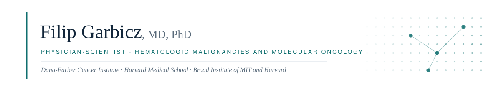

<div align="center">

<picture>
  <source media="(prefers-color-scheme: dark)" srcset="assets/banner-dark.svg">
  <source media="(prefers-color-scheme: light)" srcset="assets/banner-light.svg">
  
</picture>

<br/>

**Research Fellow** · [Dana-Farber Cancer Institute](https://www.dana-farber.org) — Carrasco Laboratory, Dept. of Pathology
**Research Fellow in Pathology** · Harvard Medical School &nbsp;·&nbsp; **Research Affiliate** · Broad Institute of MIT and Harvard

<br/>

[](https://scholar.google.com/citations?user=rIIcAVUAAAAJ)
[](https://orcid.org/0000-0002-5548-1564)
[](https://www.linkedin.com/in/filip-garbicz/)
[](https://www.researchgate.net/profile/Filip-Garbicz)
[](https://twitter.com/FilipGarbicz)
[](mailto:filipa_garbicz@dfci.harvard.edu)

</div>

<br/>

## 🩺 &nbsp; About Me

```yaml
name:         Filip Garbicz, MD, PhD
role:         Physician-Scientist — Hematologic Malignancies & Molecular Oncology
affiliation:  Dana-Farber Cancer Institute · Harvard Medical School · Broad Institute
clinical:     [MD 2017, Intern 2019, PhD 2026]
diseases:     [Waldenström macroglobulinemia, DLBCL, multiple myeloma,
               Hodgkin lymphoma, ovarian, liver & gastric cancer]
approach:     [multi-omic profiling, computational biology, in vivo modeling,
               RNA nanoparticle delivery]
mission:      "Care for the science that reaches patients."
```

I am a **physician** trained in internal medicine who now works at the interface of **pathology,
hematology-oncology, and molecular medicine**. My research asks clinical questions — why patients
relapse, which tumors resist therapy, whom to treat with what — and answers them with preclinical
models, patient-derived tissue, and multi-omic analysis.

The measure I care about is whether the work reaches patients: **two of my preclinical programs
have opened as clinical trials.**

<br/>

## 🏥 &nbsp; From Bench to Bedside

> Preclinical mechanism → therapeutic rationale → investigator-initiated trial.

<div align="center">

| 🔬 Preclinical Program | 💡 Mechanistic Rationale | 🧾 Resulting Trial |
| :--- | :--- | :--- |
| **PIM kinase biology**<br/>DLBCL & multiple myeloma<br/><sub>*Cancer Res* 2021</sub> | Pan-PIM inhibition targets the MYC transcriptional program and augments the efficacy of anti-CD20 antibodies; tissue-based PIM expression assays supported translational development of **dapolsertib (MEN1703)** | [](https://clinicaltrials.gov/study/NCT06534437)<br/>Pan-PIM inhibitor + CD20/CD3<br/>bispecific antibody<br/>*r/r aggressive B-cell NHL*<br/><sub>International</sub> |
| **Paclitaxel-induced apoptotic<br/>convergence**<br/><sub>*bioRxiv* 2025.06.24.661170</sub> | Mitotic arrest converges apoptotic dependencies onto BCL-XL, which can be safely exploited by **targeted BCL-XL degradation** to overcome chemoresistance | [](https://clinicaltrials.gov/study/NCT06964009)<br/>DT2216 (BCL-XL degrader)<br/>+ paclitaxel<br/>*Platinum-resistant ovarian cancer*<br/><sub>Dana-Farber–sponsored</sub> |

</div>

<br/>

## 🧪 &nbsp; Current Research Programs

<table>
<tr>
<td width="50%" valign="top">

### 🩸 Waldenström Macroglobulinemia

Modeling ***MYD88* L265P** and **chromosome 6q deletion** in murine B cells to build the first
mouse models of WM — defining early lymphomagenesis and the putative cell of origin, toward
next-generation diagnostics and therapeutics.

<sub>Mentor: **Dr. Ruben Carrasco** · with **Dr. Steven Treon's Lab** & the **Bing Center for
Waldenström's Macroglobulinemia**</sub>

`IWMF Robert A. Kyle Career Development Award` `NIH R01CA273123`

</td>
<td width="50%" valign="top">

### 🧬 BCL9 & Wnt-Driven Carcinogenesis

Dissecting how **BCL9 drives multi-organ carcinogenesis** through tissue-specific assembly of the
Wnt enhanceosome — extending earlier work on β-catenin/BCL9 complex inhibition.

<sub>Presented at DFCI Cancer Biology–Pathology Joint Retreat (oral) and HMS Pathology Research
Retreat (**Poster Award**, 2026)</sub>

`Wnt signaling` `Solid tumors`

</td>
</tr>
<tr>
<td width="50%" valign="top">

### 💊 RNA Nanoparticle Therapeutics

Leading translational work in **liver and gastric cancer** — identifying metabolic drivers of
disease and developing RNA nanoparticle–based delivery platforms.

<sub>In collaboration with **Dr. Robert Langer's Lab, MIT**</sub>

`Critical & emerging technology (NSTC)`

</td>
<td width="50%" valign="top">

### 🧮 Computational & Multi-Omic Oncology

Multi-omic profiling of B-cell malignancies with the **Broad Institute** — including multi-omic
analysis of **249 treatment-naive *MYD88* L265P WM patients**, and new statistical methods for
omics-based cancer data.

<sub>Cross-disciplinary: laboratory · clinical · computational</sub>

`scRNA-seq` `CyTOF` `Cancer genomics`

</td>
</tr>
</table>

<br/>

## 🎓 &nbsp; Clinical Training & Credentials

<div align="center">

| | Training | Institution | Years |
| :---: | :--- | :--- | :---: |
| 🪪 | **Full Polish Medical License** | Republic of Poland | 2019 |
| 🏥 | **Postgraduate Medical Internship**<br/><sub>Completed across 10 clinical specialties</sub> | Czerniakowski Hospital, Warsaw | 2018–2019 |
| 🌍 | **Visiting Medical Intern**<br/><sub>Internal Medicine & Gastroenterology · GI endoscopy & EUS · multidisciplinary tumor boards</sub> | Park-Klinik Weißensee<br/>(Charité-affiliated), Berlin | 2019 |
| 🫀 | **ACLS** · Responsible Conduct of Research | — | — |

</div>

<div align="center">


</div>

### 📖 Education

<div align="center">

| | Degree | Institution | Year |
| :---: | :--- | :--- | :---: |
| 🔬 | **Ph.D., Medical Sciences**<br/><sub>*"Tumor cell-intrinsic and microenvironmental functions of PIM kinases in multiple myeloma"*<br/>Defended Mar 2026 · Advisor: Przemysław Juszczyński, MD, PhD</sub> | Postgraduate School of Molecular Medicine,<br/>Medical University of Warsaw | 2026 |
| 🎓 | **M.D.** | First Faculty of Medicine,<br/>Medical University of Warsaw | 2017 |

</div>

<sub>PhD research conducted at the **Institute of Hematology and Transfusion Medicine**, Warsaw (2017–2023).</sub>

<br/>

## 📚 &nbsp; Selected Publications

<div align="center">

**23 peer-reviewed articles** — 1 first-author · 2 co-first-author · 1 co-second-author
<sub>§ = equal contribution · name in **bold**</sub>

</div>

<details open>
<summary><b>▸ Selected peer-reviewed articles</b></summary>

<br/>

**Garbicz F**, Kaszkowiak M, Dudkiewicz-Garbicz J, Dorfman DM, …, Carrasco RD, Misiewicz-Krzeminska I. (2024).
*Characterization and experimental use of multiple myeloma bone marrow endothelial cells and progenitors.*
**Int J Mol Sci**, 25(22):12047. &nbsp;`First author`

Tomasik B§, **Garbicz F**§, Braun M, Bieńkowski M, Jassem J. (2024).
*Heterogeneity in precision oncology.*
**Camb Prism Precis Med**, 2:e2. &nbsp;`Co-first author`

**Garbicz F**§, Mehlich D§, Rak B, …, Wlodarski PK. (2017).
*Increased expression of the microRNA 106b~25 cluster and its host gene MCM7 in corticotroph pituitary adenomas is associated with tumor invasion and Crooke's cell morphology.*
**Pituitary**, 20(4):450–463. &nbsp;`Co-first author`

Szydłowski M, **Garbicz F**§, Jabłońska E§, Górniak P, …, Juszczyński P. (2021).
*Inhibition of PIM kinases in DLBCL targets MYC transcriptional program and augments the efficacy of anti-CD20 antibodies.*
**Cancer Res**, 81(23):6029–6043. &nbsp;`Co-second author` &nbsp;`Basis for Phase II NCT06534437`

Du T, Fang T, Pillai SC, …, **Garbicz F**, Carrasco RD, …, Anderson KC. (2026).
*Proteasome subunit PSMD1 is a key therapeutic target in multiple myeloma.*
**Blood**, 147(20):2344–2357.

Gutierrez C, Kwok M, Ruthen N, …, **Garbicz F**, Lee M, Wu C. (2026).
*Mutant ribosomal protein RPS15 drives B-cell malignancy through oxidative stress and genomic instability.*
**Nature Communications**.

Chong SJF, Valentin R, Wang J, …, **Garbicz F**, …, Davids MS. (2026).
*CD47 blockade-driven necroptosis complements BCL-2 inhibition-driven apoptosis in lymphoid malignancies.*
**J Hematol Oncol**, 19(1):11.

Szydłowski M, Kurtz E, **Garbicz F**, …, Lech-Marańda E, Juszczyński P. (2026).
*PIM kinase inhibition attenuates pro-tumoral and immunosuppressive functions of macrophages in classic Hodgkin lymphoma.*
**Cell Death Dis**, 17(1):136.

Tanton H, Sewastianik T, Seo H-S, …, **Garbicz F**, …, Carrasco RD. (2022).
*A novel β-catenin/BCL9 complex inhibitor blocks oncogenic Wnt signaling and disrupts cholesterol homeostasis in colorectal cancer.*
**Sci Adv**, 8(17):eabm3108.

</details>

<details>
<summary><b>▸ Manuscripts under review & preprints</b></summary>

<br/>

Hunter Z, Guerrera ML, Tsakmaklis N, …, **Garbicz F**, Carrasco R, …, Treon S.
*The evolution and subtypes of Waldenström macroglobulinemia: multi-omic analysis of 249 treatment-naive MYD88 L265P patients.*
Submitted to **Nature Communications** (2025).

Qin X, Presser A, Johnson L, …, **Garbicz F**, …, Sarosiek KA.
*Paclitaxel-induced mitotic arrest results in a convergence of apoptotic dependencies safely exploited by BCL-XL degradation to overcome cancer chemoresistance.*
**bioRxiv** 2025.06.24.661170. &nbsp;`Preclinical basis for Phase Ib NCT06964009`

</details>

<details>
<summary><b>▸ Invited & selected conference presentations</b></summary>

<br/>

**Invited**

- **Garbicz F.** (2025). *"Navigating the Deep: Can Mouse Models Map the Biology of Waldenström's Macroglobulinemia?"* — IWMF Educational Forum, Ponte Vedra, FL.
- **Garbicz F.** (2024). *"Modeling MYD88 L265P Mutation and Chromosome 6q Deletion in Murine B Cells."* — Hematologic Neoplasia & Immunologic Therapies Seminar, Dana-Farber Cancer Institute.

**Selected**

- (2026) *Multi-organ carcinogenesis driven by BCL9 via tissue-dependent Wnt signaling* — DFCI Cancer Biology–Pathology Joint Retreat. `Oral`
- (2026) *BCL9 drives multi-organ carcinogenesis through tissue-specific assembly of the Wnt enhanceosome* — HMS Pathology Research Retreat. `Poster Award`
- (2025) *Modeling 6q deletion and MYD88 L265P-driven B-cell lymphomas in mice* — AACR Annual Meeting, Chicago. `Poster`
- (2023) *Transcriptomic features influencing anti-myeloma drug resistance* — 65th ASH Annual Meeting, San Diego. `Poster`
- (2022) *Super-enhancer-driven PIM kinase upregulation in multiple myeloma, efficiently targeted by MEN1703* — 64th ASH Annual Meeting, New Orleans. `ASH Abstract Achievement Award`
- (2020) *PIM kinase inhibition decreases proangiogenic properties of myeloma cells* — 62nd ASH Annual Meeting. `Poster`

</details>

<div align="center">

[](https://orcid.org/0000-0002-5548-1564)
[](https://scholar.google.com/citations?user=rIIcAVUAAAAJ)

</div>

<br/>

## 🛠️ &nbsp; Methods & Tools

<div align="center">

**🧫 Molecular, Cellular & Translational**


**🐁 In Vivo & Pathology**


**🧬 Nucleic Acid & Epigenomic Profiling**


**💻 Computational**


</div>

### 🧾 Clinical & Translational Data Analysis

> Beyond the bench: I analyze **patient-level clinical, pathologic, and trial-correlative data** —
> the evidence layer that connects a mechanism to a treatment decision.

<div align="center">


</div>

<table>
<tr>
<td width="50%" valign="top">

**Treatment response & patient survival**
Analysis of *CRBN*/*CUL4A*/*DDB1* expression predicting **response to immunomodulatory drugs and
survival** in a multiple myeloma patient cohort.
<sub>*J Clin Med* 2021 · with Institute of Hematology and Transfusion Medicine</sub>

**Patient-cohort multi-omic analysis**
Multi-omic characterization of **249 treatment-naive *MYD88* L265P Waldenström patients**,
defining disease evolution and molecular subtypes.
<sub>Submitted to *Nature Communications* · with the Bing Center / Treon Lab</sub>

</td>
<td width="50%" valign="top">

**Trial-correlative & companion diagnostics**
Development of **tissue-based PIM kinase expression assays** supporting the translational and
clinical development of dapolsertib (MEN1703).
<sub>Directly upstream of Phase II NCT06534437</sub>

**Clinicopathologic correlation**
Molecular signatures correlated with **tumor invasion, morphology, and clinical behavior** across
archival FFPE patient cohorts — pituitary, prostate, endometrial, and CNS tumors.
<sub>*Pituitary* 2017 · *Endocrine* 2019, 2025 · *Histochem Cell Biol* 2021</sub>

</td>
</tr>
</table>

<div align="center">

<sub>Framing paper: **Tomasik B§, Garbicz F§** et al. *Heterogeneity in precision oncology.*
**Camb Prism Precis Med** (2024) — on why molecular heterogeneity complicates biomarker-driven
treatment assignment.</sub>

</div>

<br/>

## 🤝 &nbsp; Open to Collaborate On

<div align="center">

| | |
| :---: | :--- |
| 🧩 | **Multi-omic approaches to cancer drug resistance** |
| 🐁 | **Preclinical disease modeling** for hematologic malignancies and solid tumors |
| 🤖 | **Big data and machine learning** in translational oncology |
| 🧬 | **RNA-based therapeutic platforms** and targeted delivery |
| 🧾 | **Biomarker-guided and companion-diagnostic trial design** |

</div>

<br/>

## 📫 &nbsp; Get in Touch

<div align="center">

[](mailto:filipa_garbicz@dfci.harvard.edu)
[](https://www.linkedin.com/in/filip-garbicz/)
[](https://twitter.com/FilipGarbicz)

<br/>

---

***"Care for the science that reaches patients."***

</div>

<!---
fgarbicz/fgarbicz is a ✨ special ✨ repository because its `README.md` (this file) appears on your GitHub profile.
--->
